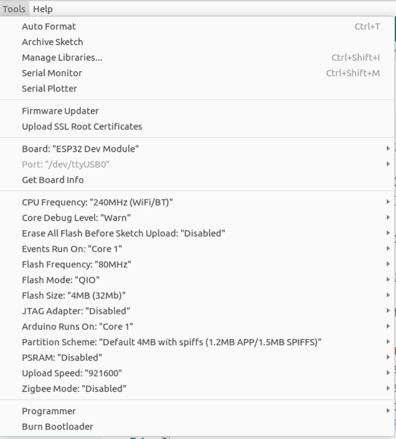

# MarcosFirmware

Firmware for the Marcos model of smallkat

# Setup

Use Arduino 2.x IDE

Esp32 toolchain for arduino version 3.0.1




```
[SimplePacketComs@1.0.1]
[WiFi@2.0.0]
[Networking@1.0.0]
[Esp32SimplePacketComs@3.0.2]
[Esp32WifiManager@1.0.2]
[Preferences@2.1.0 Preferences@2.0.0]
[ESP32Servo@3.0.4]
[EasyBNO055 ESP@0.0.3]
[Wire@2.0.0]
[Adafruit Unified Sensor@1.1.14]
[Adafruit BNO055@1.6.3]
[Adafruit BusIO@1.16.1]
[SPI@2.0.0]
```